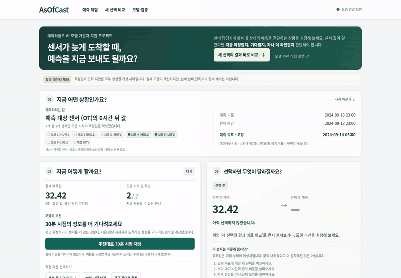
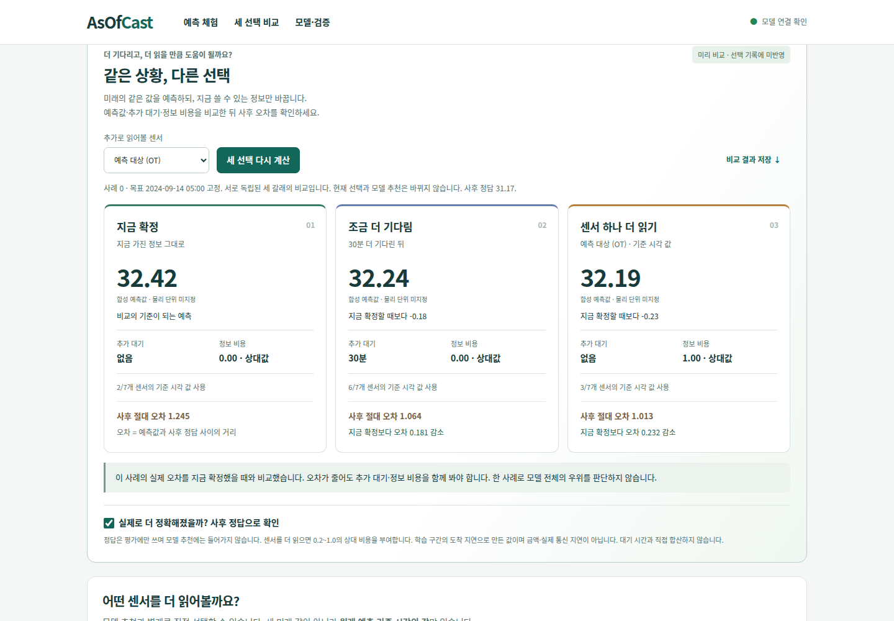
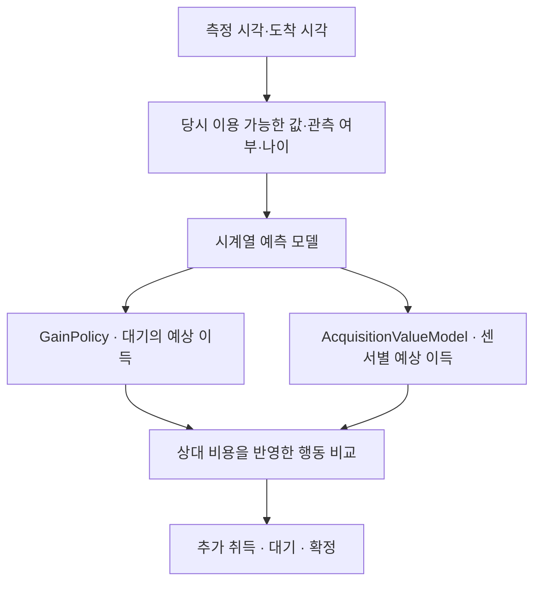

# AsOfCast M2

> **늦게 도착하는 센서 데이터에서 같은 미래 목표를 유지한 채, 지금 확정·대기·추가 확인을 비용과 함께 비교하는 시계열 AI 시스템**

설비 담당자가 몇 시간 뒤 상태를 예측해야 하지만 일부 센서가 늦게 도착하는 상황을 모델링했습니다. **측정 시각과 도착 시각을 분리해 판단 당시 알 수 있었던 정보만 사용**하고, 예측 정확도뿐 아니라 기다린 시간과 추가 정보 비용까지 함께 평가합니다.

[예측 체험](https://asofcast.onrender.com) · [API](https://asofcast.onrender.com/docs) · [데이터플로 공고 대응 근거](docs/dataflow-role-evidence.md) · [검증 기록](docs/verification.md)

## 한눈에 보는 엔지니어링 근거

| 영역 | 구현·검증 근거 |
|---|---|
| **모델 설계·학습** | PyTorch 기반 시계열 예측기와 WAIT/ACQUIRE/COMMIT 정책을 학습하고 시간순 train/policy/validation/test로 분리 |
| **성능 평가·개선** | Appliances에서 예측 MAE **10.83~11.15% 감소**를 확인했으며, 강한 단순 기준·다중 seed·bootstrap 구간으로 정책 후보는 별도 검증 |
| **서비스 추론 최적화** | FastAPI + PyTorch 기준 구현에 **ONNX Runtime 서빙 경로**를 추가하고 출력 parity·모델 identity·SHA-256을 검증. 명시적 ONNX 모드는 불일치 시 fail-closed |
| **MLOps** | **MLflow + DVC + release gate**로 실험 기록과 모델 승격 판단을 분리. 성능 기준을 못 넘은 2026-10-02 후보는 테스트 성공과 무관하게 `rejected`로 기록 |
| **대규모 데이터** | UCI ElectricityLoadDiagrams **51,894,720 measurement cells**를 PySpark로 파싱·검사하고 Parquet write/read 검증 |
| **논문 구현·재현** | **DLinear** 공식 구현을 고정해 같은 데이터·초기 조건에서 로컬 구현과 독립 학습·반복 대조 |
| **클라우드·운영 검증** | Render 공개 FastAPI의 `/health`·`/ready` 원격 smoke + Docker에서 실측 ETTh1 bundle과 검증된 ONNX runtime을 read-only mount해 재시작 smoke |

GitHub Actions는 Python 3.11/3.13 전체 테스트, 실측 ETTh1 학습, ONNX, DLinear 대조, MLflow/DVC, Spark, Docker 서빙, 브라우저 회귀를 서로 다른 job으로 실행합니다. **CI 통과는 실행 계약의 재현을 뜻하고, 모델 성능 우위는 별도의 release gate가 판단합니다.**

## 29초 데모로 먼저 보기

**[MP4 고화질 재생 · 29초](https://github.com/sokldjs554/asofcast/raw/refs/heads/main/docs/assets/live-m2/asofcast-m2-demo.mp4)** · [첫 화면 캡처](docs/assets/live-m2/m2-decision-console.png) · [모바일 화면](docs/assets/live-m2/m2-mobile.png) · [이번 데모 캡처 검증](docs/assets/live-m2/capture-report.json)

공개 Render 서비스에서 실제 모델 API를 조작한 화면입니다. 무료 호스팅이 쉬고 있으면 첫 접속에 준비 시간이 걸리므로 영상으로 먼저 확인할 수 있습니다. 공개 체험은 **측정값과 도착 지연 모두 합성**이며, 아래 ETTh1 실측 실험과 구분합니다. 영상에서 대기는 시간을 재생하는 동작이고, 센서 읽기는 기준 시각의 값 하나를 공개하는 시뮬레이션입니다.

**30초 체험 순서:** 첫 화면의 **세 선택의 결과 바로 비교** → 예측값·추가 대기·정보 비용 비교 → **실제로 더 정확해졌을까?** 켜기 → 지금 확정했을 때보다 오차가 줄었는지 확인. 모델 추천을 실제로 실행하면 선택 전후와 이번 선택에 쓴 시간·비용도 확인할 수 있습니다.

**숫자를 읽는 법:** 예측값이 내려갔다고 더 정확해진 것은 아닙니다. 사후 정답과의 거리인 **절대 오차**가 작아야 더 정확합니다. 기다리거나 센서를 추가해도 오차가 늘 수 있으며, 그 결과도 그대로 표시합니다. 정보 비용은 학습 구간의 도착 지연으로 만든 0.2~1.0의 상대값이고 실제 금액이 아닙니다.

**직무와 연구 근거까지 확인:** 체험 바로 아래의 ‘데이터플로 AI 개발 직무를 위해’에서 기술별 실행 기록을 열 수 있습니다. ‘최신 연구 판정 보기’는 Taylor·MSFT의 여섯 조건을 모두 보여주며, 평균 개선과 채택 실패를 구분합니다. 현재 서비스의 추론 방식은 API 상태로 표시하고 별도 ONNX 벤치마크와 구분합니다.

사후 평가를 켠 화면입니다. 같은 출발점의 세 선택을 실제 API로 계산하며 현재 체험 기록과 추천은 유지됩니다. 정답은 평가에만 사용합니다. [사후 평가를 켜기 전 화면](docs/assets/live-m2/m2-choice-comparison.png) · [실제 내려받은 비교 JSON](docs/assets/live-m2/comparison-example.json)

## 연구 상태와 한계

**전체 행동 정책의 일반적인 성능 우위는 아직 입증하지 못했습니다.** 2026-09-29 기상·화학 센서 새 데이터에서는 강한 단순 기준 대비 채택 조건을 통과한 경우가 0/6이었습니다. 2026-10-02 후속 후보는 새 전력·거래 시계열 6개 자료·도착 조건 중 주 수치 기준을 통과한 조건이 1개였지만, 전체 목표에는 미달해 공개 모델로 승격하지 않았습니다.

이 실패도 결과로 보존했습니다. 비용·합격 기준을 결과를 본 뒤 낮추지 않았고, `docs/research-20261002/release-decision.json`의 release gate는 해당 후보를 **rejected**로 기록합니다. 코드·재현 검사 통과와 성능 목표 달성을 같은 의미로 사용하지 않습니다.

[2026-10-02 전체 결과와 실패 조건](docs/research-20261002/RESULTS_KO.md) · [승격 판단](docs/research-20261002/release-decision.json) · [고정 프로토콜](configs/posterior_candidate_confirmation_20261002.json) · [실행기](scripts/run_posterior_confirmation.py)

데모의 연구 표는 [생성기](scripts/build_demo_evidence.py)가 보존 집계의 고정 SHA-256, 평가 파일 해시, 기존 수치 gate와 승격 판정의 일치를 확인한 뒤 만듭니다. `PYTHONPATH=src python scripts/build_demo_evidence.py --check`와 전체 테스트가 오래되거나 변조된 표시 파일을 거절합니다. 이 과정에서 연구를 다시 학습하거나 현재 체험 모델을 승격하지 않습니다.

## 면접에서 보여줄 핵심

| 확인할 역량 | 데모에서 볼 수 있는 근거 |
|---|---|
| 데이터가 늦을 때의 문제 설계 | 측정 시각과 도착 시각을 나누고, 당시 도착한 정보만 사용 |
| 모델과 의사결정 연결 | 지금 확정·대기·센서 추가 확인을 같은 미래 목표로 비교 |
| 결과 해석과 검증 | 예측 변화와 실제 오차를 구분하고, 개선되지 않는 사례도 표시 |
| 실험을 서비스로 연결 | PyTorch 모델을 FastAPI로 제공하고 재현 기록·CI·공개 데모까지 연결 |

예를 들어 첫 사례에서 30분을 기다려 예측값이 달라졌다면, 먼저 새로 확보한 센서 수를 확인합니다. 사후 정답을 켜면 **추가로 기다린 결과 오차가 줄었는지** 볼 수 있습니다. 이 비교는 한 사례의 이해를 돕는 것이며 정책의 일반적인 성능 우위를 증명하지는 않습니다.

센서의 **대상** 표시는 예측할 채널, **보조** 표시는 예측에 함께 쓰는 입력입니다. 괄호 안의 `OT`, `HUFL` 등 원본 코드는 API·실험 기록과 대조할 때 사용합니다. 합성 데이터에 온도·전력 같은 물리 단위를 임의로 붙이지 않았습니다.

## 하나의 데모에서 문제부터 결과까지

첫 화면은 **상황 → 선택 → 결과** 순서입니다. 별도 설명서를 먼저 읽지 않아도 예측 대상, 고정된 목표 시각, 아직 없는 센서 수를 확인할 수 있도록 구성했습니다.

1. **상황 확인:** 어떤 센서의 몇 시간 뒤 값을 예측하는지, 기준 시각·현재 판단·목표 시각을 구분합니다. 공개 합성 사례에는 물리 단위를 임의로 붙이지 않습니다.
2. **선택:** 모델 추천을 실행하거나 센서를 직접 읽습니다. 대기 버튼은 실제 시간을 기다리는 대신 다음 허용 시점으로 재생합니다. 확정은 화면 내 선택이며 서버 저장·장비 제어가 아닙니다.
3. **결과 확인:** 실제 선택 전후 예측과 변화량, 이번 선택의 추가 대기 시간·상대 정보 비용을 비교합니다. 예측값 변화와 정확도 향상을 구분하고, 정답을 이용한 오차 비교는 접힌 사후 평가에서 따로 제공합니다.

모델 추천을 실행한 동작과 사용자의 직접 선택은 다르게 기록합니다. 대기 버튼으로 진행해도 이미 읽은 기준 시각 값과 예측 목표는 유지됩니다. 사례·상황·비교 시작 시점을 직접 바꾸면 새 체험을 시작합니다.

**세 선택 나란히 비교:** 같은 사례·입력·목표 시각에서 지금 확정, 다음 판단 시점까지 대기, 선택 센서 하나 추가 취득을 각각 실제 API로 계산합니다. 세 갈래의 예측값·확보한 센서 수·추가 정보 비용을 함께 보여주며 현재 체험 기록이나 모델 추천은 바꾸지 않습니다. 기존에 취득한 값도 각 갈래에 유지합니다. 정답과 절대 오차는 사용자가 사후 평가를 켰을 때만 표시합니다.

비교 JSON에는 모델 실행 ID, 데이터 종류, 시작 조건, 선택별 결과와 제한사항이 들어갑니다. 사후 평가를 켜지 않았다면 정답은 내보내지 않습니다. 이 비교는 **한 사례의 선택 결과**이며 정책의 일반적인 성능 우위를 뜻하지 않습니다.

**모델과 검증 근거**를 펼치면 같은 페이지에서 센서별 예상/실제 이득, 상대 비용, 정책 점수, 모델 간 예측 차이, 비용–오차 곡선과 실험 범위를 확인할 수 있습니다. 대기만 했을 때의 가상 비교는 사용자가 실행한 기록과 섞지 않습니다. 사후 정답은 화면의 평가용이며 정책 행동 계산에는 사용하지 않습니다.

## Causal contract

### Passive data

판단 시각 d, frozen forecast origin o에서 모델 입력으로 사용할 수 있는 값은:

~~~text
event_time <= o
arrival_time <= d
~~~

두 조건을 동시에 만족해야 합니다.

### Active acquisition

센서 c를 active acquire하면:

~~~text
reveal = value[event_time = frozen_origin, channel = c]
~~~

만 허용합니다.

- origin 이후 event는 공개하지 않음
- 실제 future arrival time을 정책 feature로 사용하지 않음
- target은 기다리거나 취득해도 고정
- target truth는 offline label / retrospective audit에만 사용

## 모델 구조

AcquisitionValueModel은 작은 MLP이며, 현재 snapshot·현재 forecast·candidate channel identity·train-derived cost proxy만으로 **한 번의 sensor pull이 줄일 것으로 예상되는 absolute error**를 추정합니다.

## 정보 가치 추정의 후속 검증 · 2026-09-29

한 단계 행동 이득 추정을 두 단계로 확장하고, 세 모델의 불일치에 벌점을 적용했습니다. 검증에서 단순 방법을 유지할 수도 있게 했습니다. 새 데이터 학습 전에 코드·비용·판정 기준을 원격 저장소에 고정했습니다.

| 새 확인 데이터 | 기존 순차 정책 대비 손실 개선 | 같은 예측기의 강한 단순 기준 대비 개선 | 판정 |
|---|---:|---:|---|
| Jena2020 · 기상 | 1.73~2.30% | -0.06~+0.15% | 기준 미달 |
| GasCO · 화학 센서 | 22.12~24.89% | -0.69~+1.15% | 기준 미달 |

각 범위는 세 학습 시드 평균을 세 지연 조건별로 계산했습니다. 기존 정책보다 나아졌어도 단순 기준 대비 1% 개선·양수 신뢰구간·모든 시드 개선·MAE 제한을 모두 충족한 조건은 **0/6개**입니다. 독립 재학습 두 번에서 2,106개 배열과 기본 모델 텐서 288개가 정확히 같았으며, **실패 판정도 재현**됐습니다. 공개 모델은 새 후보로 교체하지 않았습니다.

[상세 결과·한계·프로토콜 대비 누락·재현 명령](docs/information-value-20260929.md) · [전체 결과 JSON](docs/assets/information-value/report.json)

## 모델 개선과 전체 행동 평가 · 2026-09-29

개선 가능성 진단부터 예측기·행동 선택기의 분리 개선, 전체 WAIT/ACQUIRE/COMMIT 평가, 새 데이터 확인까지 실행했습니다. **새 데이터 결과를 보기 전에** 손실 1% 이상 감소·95% 구간 하한 양수·모든 학습 시드 개선·MAE 악화 최대 1%라는 채택 기준을 고정했습니다.

| 데이터 | 추가 행동 없이 예측 오차 감소 | 새 조합의 기존 순차 정책 대비 손실 감소 | 검증 선택 단순 방법 대비 손실 감소 |
|---|---:|---:|---:|
| ETTh1 · 기존 개발 데이터 | 0% | 1.93~4.40% | -0.11~+0.07% |
| ETTh2 · 기존 개발 데이터 | 0.70~0.94% | 2.38~3.86% | 1.76~2.14% |
| Appliances · 새 건물 데이터 | 10.83~11.15% | 11.49~11.74% | -0.92~-0.67% |
| Tetouan · 새 도시 데이터 | 0% | 12.42~14.18% | -1.28~-0.89% |

각 범위는 세 학습 시드의 평균을 지연 조건별로 계산한 값입니다. 양수는 개선, 음수는 악화입니다. 단순 방법도 개선된 예측기를 사용할 수 있게 했습니다. **예측기 개선은 확인됐지만, 기다리거나 센서를 추가 확보하는 정책의 일반적인 이득은 확인하지 못했습니다.** 새 데이터 채택 기준은 실패했고 공개 모델은 교체하지 않았습니다. 도착 시각·취득 지연·비용은 시뮬레이션이므로 실제 운영 절감액을 뜻하지 않습니다.

전체 36개 설정 × 15개 방법의 성적, 행동열, 시점별 손실, 재학습 재현 결과와 출처는 [연구 검증 문서](docs/research-diagnosis-20260929.md)에 있습니다.

## 추가 모델 성능 검증 · 2026-09-28

단일 데이터셋·초기값 결과만으로 모델 효과를 판단하지 않도록 **ETTh1·ETTh2 × 학습 seed 3개 × 지연 조건 3개**를 평가했습니다. 학습·정책 학습·후보 선택·최종 평가는 시간순으로 분리했습니다. 아래 수치는 각 데이터셋의 기본 지연 조건에서 seed 3개를 평균한 결과입니다.

| 비교 | ETTh1 | ETTh2 |
|---|---:|---:|
| DLinear MAE → 현재 보정 예측기 MAE | 1.1254 → 1.1083 | 2.6459 → 2.6463 |
| 바로 확정: 오차+취득비용 | 0.125787 | 0.219327 |
| 기존 MLP 센서 취득: 오차+취득비용 | 0.128531 | 0.218770 |
| 새 ridge 후보: 오차+취득비용 | 0.126021 | 0.219153 |

비용 포함 지표는 **학습 구간 표준편차로 표준화한 절대 오차 + 0.03 × 상대 취득 비용**이며 낮을수록 좋습니다. 위 두 데이터셋의 수치를 직접 합산하지 않습니다. 검증 구간에서 선택한 단순 기준은 모두 바로 확정이었습니다.

현재 보정 예측기는 ETTh1에서 도움이 됐지만 ETTh2에서 같은 개선을 보이지 않았습니다. 새 센서별 ridge 후보도 일부 조건에서 기존 MLP보다 비용 포함 손실을 줄였지만, **모든 조건에서 단순 기준과 기존 MLP를 안정적으로 이겨야 한다는 채택 기준에는 실패**했습니다. 공개 모델은 교체하지 않았습니다.

전체 조건, 시간 의존성을 고려한 구간 추정, 반복 실행, 원시 손실과 재현 명령은 [추가 성능 검증 문서](docs/model-evidence-20260928.md)에 있습니다. CI 성공은 코드·실행 검증의 성공이며 이 성능 기준의 통과를 의미하지 않습니다.

## ETTh1 M2 초기 검증 · 단일 seed

개발 브랜치 원격 검증 run **35315014365**에서 체크섬이 고정된 ETTh1을 실제로 내려받아 M2 전체 학습·평가를 실행했습니다.

ETTh1 원본에는 transport arrival timestamp가 없으므로 **측정값은 실측, arrival delay는 synthetic condition**입니다.

### 기본 acquisition cost weight = 0.03

| 항목 | 결과 |
|---|---:|
| test cases | 640 |
| immediate MAE | 1.1046 |
| learned one-shot acquisition MAE | **1.1037** |
| hindsight one-shot oracle MAE | 0.9221 |
| acquisition rate | 8.59% |
| mean relative cost proxy | 0.0844 |
| mean realized gain | 0.0009 |
| oracle mean gain | 0.1825 |
| regret to oracle | 0.1815 |
| oracle sensor top-1 hit | 3.30% |

**해석:** 기본 비용 가중치에서 learned acquisition은 immediate보다 아주 조금만 개선됐고, oracle과의 격차는 큽니다. 따라서 “센서 선택 정책이 해결됐다”거나 “baseline보다 일반적으로 우월하다”고 주장하지 않습니다. 오히려 **현재 value model이 어디까지 잘못 선택하는지까지 정량화**한 것이 M2의 평가 포인트입니다.

### Cost vs Accuracy

| cost weight | MAE | acquisition rate | mean cost proxy |
|---:|---:|---:|---:|
| 0.00 | 1.0929 | 84.84% | 0.8329 |
| 0.01 | 1.0984 | 57.34% | 0.5630 |
| 0.03 | 1.1037 | 8.59% | 0.0844 |
| 0.05 | 1.1042 | 1.88% | 0.0185 |
| 0.10 | 1.1046 | 0% | 0 |

이 표는 “센서를 더 읽으면 무조건 좋다”가 아니라 **추가 정보의 양과 예측 오차 사이의 실제 trade-off**를 보여주기 위한 evidence입니다.

## 기존 wait policy

M2는 M1의 passive wait 경로도 유지합니다.

- learned wait policy MAE: 1.1282
- matched random-mixture MAE: 1.1326
- 평균 wait: 53.44초
- full wait가 error를 줄인 사례: 52.66%

차이가 작으므로 wait policy 역시 일반적인 우월성을 주장하지 않습니다.

초기 합성 데이터 3개 seed의 조건별 비교에서는 학습형 대기 정책이 데이터 나이 기준보다 **오차+대기비용**에서 뒤졌습니다. 값이 낮을수록 좋습니다.

| 도착 지연 조건 | 데이터 나이 기준 | 학습형 대기 |
|---|---:|---:|
| 일반 | 0.228573 | 0.229112 |
| 몰림 | 0.306853 | 0.311859 |
| 중단 | 0.312596 | 0.320211 |

이는 합성 조건의 세 실행 평균이며, 위 ETTh1의 무작위 혼합 정책 비교와 데이터·지표가 다릅니다. 합성 지연 환경에서 학습 정책의 우위를 확인하지 못했다는 범위로 해석합니다.

## 추론 최적화

**현재 API의 실행 엔진은 PyTorch CPU입니다. ONNX Runtime은 별도 최적화 비교 경로입니다.**

2026-09-25 재검토에서 과거 ONNX 비교의 PyTorch 호출이 실제 서빙과 달리 autograd를 기록한 것을 확인했습니다. 이전 `0.239 ms → 0.058 ms`와 후속 `0.2192 ms → 0.0434 ms`는 동일 조건 비교가 아니므로 현재 성능 개선 수치로 사용하지 않습니다. 과거 기록은 [검증 이력](docs/verification.md)에 남깁니다.

수정한 비교는 두 엔진에 동일한 NumPy float32 입력을 주고 NumPy 출력을 받는 범위를 측정합니다. PyTorch는 `inference_mode`, CPU intra-op 2 threads, ONNX Runtime은 sequential 실행을 사용합니다. 준비 실행 후 엔진 실행 순서를 번갈아 측정하고, 원시 지연 샘플·버전·스레드·출력 편차를 함께 저장합니다. 이는 HTTP 지연이나 Render 운영 SLA가 아닙니다.

출력 모양 불일치·NaN/Inf·표준화 출력 편차 1e-4 초과·런타임 실패는 보고서 `failed` 및 명령 실패로 이어집니다. [main CI 36127591680](https://github.com/sokldjs554/asofcast/actions/runs/36127591680)에서 실제 ONNX Runtime 3회 측정, 오류 주입 5종 차단, 원시 샘플 독립 재계산을 확인했습니다.

| 같은 실행 내 비교 · batch=1 | PyTorch p95 (ms) | ONNX Runtime p95 (ms) |
|---|---:|---:|
| 1 | 0.19528505 | 0.10470550 |
| 2 | 0.19619150 | 0.10551750 |
| 3 | 0.19609105 | 0.09857455 |

공유 CPU runner의 모델 NumPy 입출력 호출 범위입니다. 현재 공개 API는 PyTorch CPU로 실행하며, 이 표는 API 응답시간 또는 운영 환경의 속도 개선 근거가 아닙니다.

기존 INT8 비교는 이미 inference mode였으며 위 결함과 구분합니다. 과거 동일 실행에서 FP32 p95 0.156 ms, dynamic INT8 0.282 ms였기에 INT8은 채택하지 않았습니다. 서로 다른 실행의 기준값은 섞지 않습니다.

## DLinear 공식 구현 대조 실험

M2 자체는 고정된 미래 목표 한 개를 예측하는 문제이며 원논문 점수 재현이 아닙니다. 별도 실험은 공식 구현 커밋을 고정해 ETTh1 다변량 `336 → 96`, 7개 채널, 학습 구간 정규화, 시간순 분할, Adam/학습률 0.005/최대 10 epoch/early stopping 설정으로 비교합니다.

공식 모델과 자체 모델은 초기 가중치를 한 번 맞춘 뒤 같은 CPU 학습 절차에서 **각각 독립 학습**합니다. 전체 테스트 예측과 MSE·MAE를 비교하고, 동일 seed로 2회 반복합니다. 이 실험도 원래 GPU 실행 환경이나 논문 전체 표의 재현을 뜻하지 않습니다. 실행 조건·차이·명령·근거 범위는 [수정 검증 안내](docs/verification-repair.md)에 있습니다.

## 대용량 처리와 MLOps

- **51,894,720 measurement cells** — UCI ElectricityLoadDiagrams20112014
- PySpark: wide CSV parse → numeric cast → null scan → Parquet write/read
- MLflow: verified ETTh1 experiment tracking
- DVC: model/replay artifact pointer
- GitHub Actions: Python 3.11/3.13, ETTh1, ONNX, MLflow/DVC, Spark, cloud smoke
- FastAPI + Render Singapore public deployment
- /health + /ready remote smoke test

## API

- GET /api/acquisition — 현재 sensor ranking + joint action
- POST /api/acquire — stateless origin-slot acquisition 후 재계산
- GET /api/revision-timeline — passive/active prediction revision
- GET /api/pareto — cost/error evidence
- GET /api/audit — 추천 행동의 현재-state 근거
- GET /api/replay — passive replay
- POST /api/predict — caller-provided history inference
- GET /docs — OpenAPI

## 실행

Python 3.11–3.13.

~~~bash
python -m venv .venv
.venv/bin/python -m pip install -e ".[dev]"

python -m asofcast generate --out data/synthetic/demo.csv --rows 7200 --seed 21
python -m asofcast run   --csv data/synthetic/demo.csv   --source-kind synthetic   --config configs/synthetic_m1.json   --out artifacts/demo

python -m asofcast verify --artifacts artifacts/demo
python -m asofcast serve --artifacts artifacts/demo
~~~

설정 파일명은 M1과의 재현 호환성을 위해 유지하지만 현재 파일에는 M2 acquisition training 설정도 포함되어 있습니다.

## 주장하지 않는 범위

- 실제 산업 센서 장비에 pull 명령을 보낸 실증이 아닙니다.
- acquisition cost는 돈/실측 장비 latency가 아닌 train-delay 기반 relative proxy입니다.
- ETTh1의 measurement는 real이지만 arrival timestamp는 synthetic입니다.
- learned acquisition의 일반적인 superiority는 입증하지 않았습니다.
- hindsight oracle은 배포 가능한 정책이 아닙니다.
- DLinear 원 논문의 long-horizon score reproduction이 아닙니다.
- 공개 Render demo는 production SLA·인증·감사로그를 갖춘 상용 서비스가 아닙니다.

## 참고

- Zeng et al., *Are Transformers Effective for Time Series Forecasting?*, AAAI 2023
- DLinear reference: https://github.com/cure-lab/LTSF-Linear
- ETT dataset: https://github.com/zhouhaoyi/ETDataset

원본 데이터와 외부 의존성의 권리는 각 제공자에게 있습니다. 이 저장소는 별도의 오픈소스 사용허락을 부여하지 않습니다.
